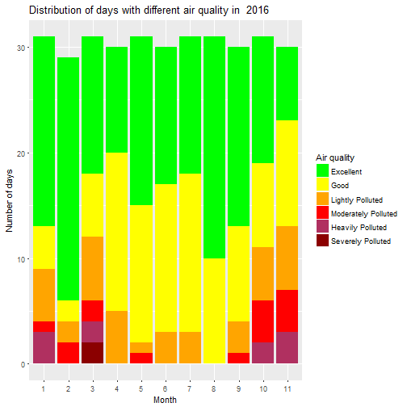

Document for the Beijing Air Quality Trend
========================================================
author: Gang Xu
date: 02/02/2017
autosize: true

Introduction
========================================================

This is a document for shiny-based app generated in RStudio. There are two interactive graphs in the app. The first graph shows how many days in each calendar month were categorized into 6 different levels with PM2.5 values in the year between 2008 and 2016, which can be selected on the page. The second graph shows the air quality trend in the continuous years between 2008 and 2016 with 6 different air quality levels.

- Fig 1: Distribution of days with differnt air quality level in specific year.
- Fig 2: The percentage trend of days in current year for 6 air quality categories.

Data Source
========================================================

The historical data can be download from <http://www.stateair.net/web/historical/1/1.html>. Part of the data were missed in the file and were ignored in the analysis. The content and definition of the data was described in the doc <http://www.stateair.net/web/assets/USDOS_AQDataFilesFactSheet.pdf>. Users of the U.S. Department of State air quality data files must abide by the data use conditions outlined in the Data Use Statement <http://www.stateair.net/web/assets/USDOS_AQDataUseStatement.pdf>.


Data Manipulation
========================================================

The data has been manipulated according to the definition of AQI (Air Quality Index). Although the given data was PM2.5 value instead of AQI, we categorized PM2.5 into 6 levels for convenience. 


```r
beijing_air$Value[beijing_air$Value==-999] <- NA
avg_air <- summarise(group_by(beijing_air, Year, Month, Day), avgValue = round(mean(Value, na.rm = TRUE)))
avg_air$pollution <- cut(avg_air$avgValue, c(0,50, 100, 150, 200, 300, 1000))
levels(avg_air$pollution) <- c("Excellent", "Good", "Lightly Polluted", "Moderately Polluted", "Heavily Polluted", "Severely Polluted")
```

Interactive Graph
========================================================

The interactive shiny app was built in RStudio. The year can be chosen to show stacked barplot with days in different air condition by month in the first graph. In the second graph, you can choose which air condition trend you want to see in the graph. As shown in the graph, we can tell the days with Excellent air quality was increasing in the last 9 years significantly. And the light polluted days were reduced in the long trend.


